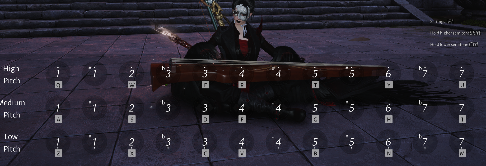

# WWMP - Where Winds Meet MIDI Player

A lightweight Windows app that plays MIDI files through the in-game instrument in *Where Winds Meet* by simulating keyboard input.



## Overview

The game features a 21-note instrument (7 scale degrees × 3 octaves) with sharps and flats accessible via modifier keys:

| Octave | Keys | Natural | Sharp (Shift+) | Flat (Ctrl+) |
|--------|------|---------|----------------|--------------|
| High   | Q W E R T Y U | 1̇ 2̇ 3̇ 4̇ 5̇ 6̇ 7̇ | ✓ | ✓ |
| Medium | A S D F G H J | 1 2 3 4 5 6 7 | ✓ | ✓ |
| Low    | Z X C V B N M | 1̣ 2̣ 3̣ 4̣ 5̣ 6̣ 7̣ | ✓ | ✓ |

This gives access to a full chromatic 3-octave range (36 playable pitches).

## Features

- **MIDI Import**: Load standard MIDI files (.mid)
- **Auto-mapping**: Convert MIDI notes to in-game keypresses
- **Transpose**: Shift songs to fit the instrument's range
- **Tempo Control**: Speed up or slow down playback
- **Polyphony Limiting**: Reduce chords to fit what's playable
- **Global Hotkeys**: Start/stop playback while in-game

## Tech Stack

| Component | Technology |
|-----------|------------|
| Backend | Rust |
| Frontend | Tauri + HTML/CSS/JS |
| MIDI Parsing | `midly` crate |
| Keyboard Simulation | `windows` crate (SendInput API) |
| Config Storage | JSON in `%APPDATA%\WWMP` |

## Architecture

```
┌─────────────────────────────────────────────────────────┐
│                    Tauri Frontend                       │
│                  (HTML/CSS/JS UI)                       │
└─────────────────────┬───────────────────────────────────┘
                      │ IPC Commands
┌─────────────────────▼───────────────────────────────────┐
│                    Rust Backend                         │
├─────────────────────────────────────────────────────────┤
│  ┌─────────────┐  ┌─────────────┐  ┌─────────────────┐  │
│  │ MIDI Engine │  │   Mapper    │  │ Playback Engine │  │
│  │             │  │             │  │                 │  │
│  │ • Parse SMF │  │ • MIDI note │  │ • Timeline      │  │
│  │ • Tempo map │  │   → degree  │  │ • Hi-res timer  │  │
│  │ • Flatten   │  │ • Transpose │  │ • Event queue   │  │
│  └─────────────┘  │ • Range fit │  └────────┬────────┘  │
│                   └─────────────┘           │           │
│  ┌─────────────────────────────────────────▼────────┐   │
│  │              Keyboard Input Module               │   │
│  │                                                  │   │
│  │  • SendInput wrapper    • Modifier handling      │   │
│  │  • Key down/up          • Panic reset            │   │
│  └──────────────────────────────────────────────────┘   │
└─────────────────────────────────────────────────────────┘
```

## Core Concepts

### Note Mapping

The in-game instrument uses a **major scale** layout. MIDI notes map to scale degrees:

```
Scale Degree:  1   2   3   4   5   6   7
Semitones:     0   2   4   5   7   9   11
```

For chromatic notes (black keys), use modifiers:
- **Sharp (+1 semitone)**: Hold Shift
- **Flat (-1 semitone)**: Hold Ctrl

### Keyboard Simulation

```
Natural note:  KeyDown(letter) → wait → KeyUp(letter)
Sharp note:    KeyDown(Shift) → KeyDown(letter) → wait → KeyUp(letter) → KeyUp(Shift)
Flat note:     KeyDown(Ctrl) → KeyDown(letter) → wait → KeyUp(letter) → KeyUp(Ctrl)
```

### Playback Pipeline

1. **Load MIDI** → Parse file, extract note events, build tempo map
2. **Flatten** → Merge tracks, convert ticks to milliseconds
3. **Map** → Convert MIDI note numbers to (octave, degree, accidental)
4. **Filter** → Apply polyphony limit, drop out-of-range notes
5. **Schedule** → Build keystroke timeline with precise timing
6. **Play** → High-resolution timer fires keystrokes via SendInput

## Configuration

Settings stored in `%APPDATA%\WWMP\config.json`:

```json
{
  "reference_midi_note": 60,
  "default_tempo_factor": 1.0,
  "max_polyphony": 2,
  "start_delay_ms": 500,
  "hotkeys": {
    "play_pause": "F7",
    "stop": "F8"
  }
}
```

### Key Mapping

Default mapping (matches in-game defaults):

```json
{
  "high":   ["Q", "W", "E", "R", "T", "Y", "U"],
  "medium": ["A", "S", "D", "F", "G", "H", "J"],
  "low":    ["Z", "X", "C", "V", "B", "N", "M"]
}
```

## Development

### Prerequisites

- Rust (latest stable)
- Node.js (for Tauri frontend)
- Windows 10/11

### Setup

```bash
# Install Tauri CLI
cargo install tauri-cli

# Clone and build
git clone <repo>
cd wwmp
cargo tauri dev
```

### Project Structure

```
wwmp/
├── src-tauri/
│   ├── src/
│   │   ├── main.rs           # Tauri entry point
│   │   ├── midi.rs           # MIDI parsing & flattening
│   │   ├── mapper.rs         # Note mapping logic
│   │   ├── playback.rs       # Timeline & scheduling
│   │   ├── keyboard.rs       # SendInput wrapper
│   │   └── config.rs         # Settings management
│   ├── Cargo.toml
│   └── tauri.conf.json
├── src/
│   ├── index.html
│   ├── styles.css
│   └── main.js
└── README.md
```

## Roadmap

### Phase 1: Foundation
- [ ] Tauri project scaffold
- [ ] SendInput keyboard test (verify injection works)
- [ ] Basic UI shell

### Phase 2: Instrument Layer
- [ ] Define note model (octave, degree, accidental)
- [ ] Implement key mapping config
- [ ] Visual keyboard tester in UI

### Phase 3: MIDI Integration
- [ ] MIDI file loading with `midly`
- [ ] Tempo map extraction
- [ ] Track flattening to timeline

### Phase 4: Playback
- [ ] MIDI → instrument note mapping
- [ ] Transpose & range fitting
- [ ] High-res playback timer
- [ ] Play/pause/stop controls

### Phase 5: Polish
- [ ] Polyphony limiting
- [ ] Global hotkeys
- [ ] Game window detection
- [ ] Persist settings
- [ ] Error handling & logging

## License

MIT
